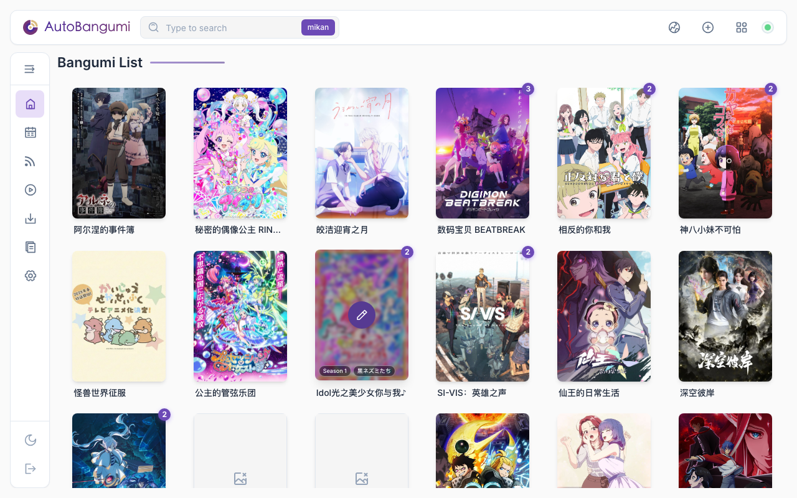

<p align="center">
    
    
</p>
<p align="center">
    
    
    
    
</p>

<p align="center">
  简体中文 | <a href="https://www.autobangumi.org/en/">English</a> | <a href="https://www.autobangumi.org/ja/">日本語</a>
</p>

<p align="center">
  <a href="https://www.autobangumi.org">官方网站</a> | <a href="https://www.autobangumi.org/deploy/quick-start.html">快速开始</a> | <a href="https://www.autobangumi.org/changelog/3.3.html">更新日志</a> | <a href="https://t.me/autobangumi_update">更新推送</a> | <a href="https://t.me/autobangumi">TG 群组</a>
</p>

# 项目说明

<p align="center">
    
</p>

> [!NOTE]
> 本项目是基于 [EstrellaXD/AutoBangumi](https://github.com/EstrellaXD/Auto_Bangumi) 3.3 的**自用修改 Fork**，在原版基础上新增了 Jellyfin 媒体库深度集成、订阅检查计划、剧集总览等大量功能（见下方「本 Fork 新增功能」）。
本项目是基于 RSS 的全自动追番整理下载工具。只需要在 [Mikan Project][mikan] 等网站上订阅番剧，就可以全自动追番。
并且整理完成的名称和目录可以直接被 [Plex][plex]、[Jellyfin][plex] 等媒体库软件识别，无需二次刮削。

## AutoBangumi 功能说明

### 核心功能

- 简易单次配置就能持续使用
- 无需介入的 `RSS` 解析器，解析番组信息并且自动生成下载规则
- 首次运行设置向导，7 步引导完成配置
- 番剧文件整理:

    ```
    Bangumi
    ├── bangumi_A_title
    │   ├── Season 1
    │   │   ├── A S01E01.mp4
    │   │   ├── A S01E02.mp4
    │   │   ├── A S01E03.mp4
    │   │   └── A S01E04.mp4
    │   └── Season 2
    │       ├── A S02E01.mp4
    │       ├── A S02E02.mp4
    │       ├── A S02E03.mp4
    │       └── A S02E04.mp4
    ├── bangumi_B_title
    │   └─── Season 1
    ```

- 全自动重命名，重命名后 99% 以上的番剧可以直接被媒体库软件直接刮削

    ```
  [Lilith-Raws] Kakkou no Iinazuke - 07 [Baha][WEB-DL][1080p][AVC AAC][CHT][MP4].mp4 
  >>
   Kakkou no Iinazuke S01E07.mp4
  ```

- 自定义重命名，可以根据上级文件夹对所有子文件重命名。
- 季中追番可以补全当季遗漏的所有剧集
- 高度可自定义的功能选项，可以针对不同媒体库软件微调
- 支持多种 RSS 站点，支持聚合 RSS 的解析
- 无需维护完全无感使用
- 内置 TMDB 解析器，可以直接生成完整的 TMDB 格式的文件以及番剧信息

### 3.3 新功能

- **程序内更新**：在日志页面检查、应用和回滚更新，并进行 sha256 与 ed25519 签名校验
- **多供应商 LLM 解析器**：支持 OpenAI 兼容接口、Anthropic Claude、Google Gemini，并提供 fallback / primary 模式
- **aria2 一等下载器支持**：支持添加、查询、重命名、管理与重复检测，不再只是简单添加任务
- **剧场版 / OVA / Special 支持**：自动识别电影、OVA、OAD、SP 等类型并按媒体库友好的结构整理
- **单番发布偏好**：可为单个番剧设置字幕组与分辨率偏好，避免同集多字幕组重复下载
- **SSE 驱动的 WebUI**：状态、下载器与日志页面改用事件流更新，减少轮询并提升稳定性
- **安全与架构升级**：全异步后端、加固的认证栈、健康检查和更可靠的数据库迁移

## 本 Fork 新增功能（对比原版 3.3）

### 1. Jellyfin 媒体库深度集成

配置位置：**设置 → 媒体库（Jellyfin）**，填入服务器地址和 API Key 即可启用。

| 开关 | 作用 |
|---|---|
| 启用 Jellyfin 集成 | 在剧集总览中显示每集"已在库 / 不在库"状态 |
| 订阅时跳过已在库的集 | 订阅时"立即下载现有集数"会先查库，已有的集不下载 |
| 追新时跳过已在库的集 | 后台轮询发现新集先查库，已有的不下载，防止手动整理后重复下载 |

- 比对按"**剧集名 + 季/集**"进行，不看文件名——Jellyfin 里存的是同剧不同版本资源（如手动整理的 B-Global 版）也能正确识别为已有
- 匹配失败（找不到剧集/接口异常）一律视为不在库，**照常下载**，宁可重复不漏下

### 2. 剧集总览

入口：**RSS 管理页的"剧集总览"按钮**、**主页/日历番剧卡片悬停的 📋 按钮**。

- 双视图切换：**按集数**（E01/E02… + TMDB 放送日期 + 多版本子列表）/ **按原始文件名**（逐条列出报文种子及其识别出的集数）
- 每集三种标签：**已在库**（Jellyfin 比对）/ **已下载** / **可下载**，标签可点击手动修改（手动覆盖带"手"角标，勾选后可一键重置恢复自动判断）
- 勾选任意条目（含未匹配番剧的种子）单个/批量下载
- **秒开缓存**：总览数据缓存在服务端，按该订阅的检查计划到期或手动点"刷新"才重新拉取，右上角显示"缓存于 HH:MM"

### 3. 订阅检查计划

配置位置：编辑规则 / 添加 RSS 弹窗 → **高级设置 → 检查计划**，每个订阅独立设置。

- **固定间隔**：5 分钟 ~ 24 小时自选
- **每周定时**：星期几（可多选）+ 24 小时制时间（精确到分钟），如"周日 20:30"——适合知道固定播出时间的番剧，其余时间完全不抓取
- **调度精度**：后台以 60 秒节拍扫描到期任务，已定时的订阅严格按计划执行（±1 分钟内）
- **未到期的订阅源整轮跳过网络抓取**——设"每周定时"的源一周只真正请求一次
- 常规设置里的"RSS 检查间隔"现在**只作用于未设置检查计划的订阅**

### 4. 订阅与放送信息增强

- **订阅时可选是否立即下载现有集数**（添加 RSS 弹窗开关，默认开启保持原行为；关闭则只登记订阅、按检查计划追新）
- **"收集"按钮带说明**：悬停显示其行为（一次性下载当前报文全部集数，不登记订阅不追新）
- **放送星期自动获取**：编辑规则的"自动获取"按钮，bgm.tv 日历优先、TMDB 首播日期兜底；元数据刷新也会自动补全缺失的放送星期，番剧日历自动排期
- **偏移辅助**：季度/集数偏移带感叹号悬停说明，集数偏移旁有"自动检测"（按 TMDB 集数推算）
- 添加 RSS 弹窗的高级设置与编辑规则完全对齐（季度偏移、放送星期、内容类型、检查计划、偏好字幕组/分辨率）

### 5. 界面优化

- **视口等比缩放**：窗口高度不足时整个界面按比例缩放，不再出现页面级滚动条（各分辨率实测无溢出）
- 主页/日历**卡片悬停操作**：悬停番剧卡片直接选择"编辑规则"或"剧集总览"
- 设置页左侧导航点击/滚动高亮精确同步（含触底与平滑滚动场景）
- 大量图标、提示、标签交互细节修复

### 6. 部署增强

- **`AB_WEBUI_PORT` 环境变量改端口**：每次启动都生效（环境变量优先于配置文件），容器健康检查自动跟随该端口。已部署过的实例也能直接通过环境变量换端口，无需重建配置卷：

  ```yaml
  services:
    AutoBangumi:
      image: shiamiea/auto-bangumi:latest
      environment:
        - AB_WEBUI_PORT=7892   # 改成想要的端口
      ports:
        - "7892:7892"          # 宿主机端口可自行映射
  ```

### 数据库变更

含 v25 ~ v28 迁移（单订阅检查计划、剧集标签覆盖、剧集总览缓存），旧数据库启动时自动升级，无需手动操作。


***已支持的下载器：***

- qBittorrent
- aria2


## 贡献

欢迎提供 ISSUE 或者 PR, 贡献代码前建议阅读 [CONTRIBUTING.md](CONTRIBUTING.md)。

贡献者名单请见：

<a href="https://github.com/EstrellaXD/Auto_Bangumi/graphs/contributors"></a>


## Licence

[MIT licence](https://github.com/EstrellaXD/Auto_Bangumi/blob/main/LICENSE)

[mikan]: https://mikanani.me
[plex]: https://plex.tv
[jellyfin]: https://jellyfin.org
